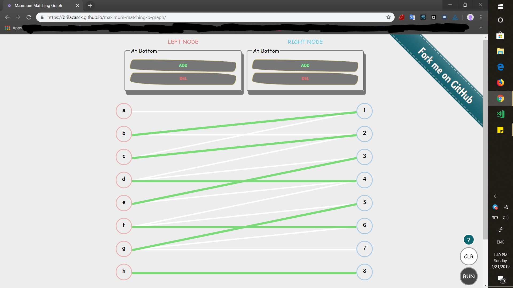

# maximum-matching-graph

\>\> See the [demo](https://brilacasck.github.io/maximum-matching-b-graph/)

Find maximum matchings in an arbitrary **bipartite graphs** with `Node.js` and `React.js`

## Algorithm

The Algorithm is, using the **BFS** and **DFS** traversal to find **Augmenting Paths**.

---

```js
let M = null;
while(true) {
    const P = findAugPath(M) // find augmenting path with respect to M
    if (P == null){
        break;
    }
    M = disjunctiveUnion(M, P) // symmetric difference: M <- M Δ P
}
return M;
```

---

### Augmenting Path

An augmenting path has the conditions bellow:

- Is an **alterantive** path
- The **start** and **end** nodes are **not saturated** by the matching

---



## Authors

- **Alireza Kavian** ( [@alirezakay](https://github.com/alirezakay) )

## Acknowledgements

The algorithm implemented in Node JS, is adapted from my mate's code in written in **python**:

- **Soheil Changizi**
  - maximum matching graph in [python codes](https://github.com/cocolico14/maximum-matching-graph)

## License

This project is licensed under the **MIT** License - see the [LICENSE](./LICENSE) file for details
